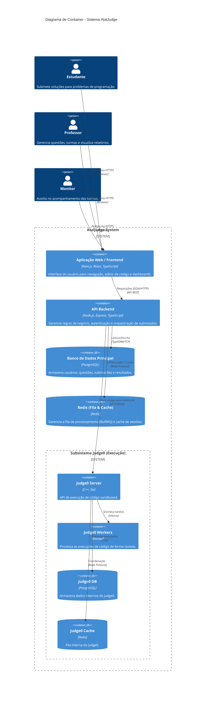
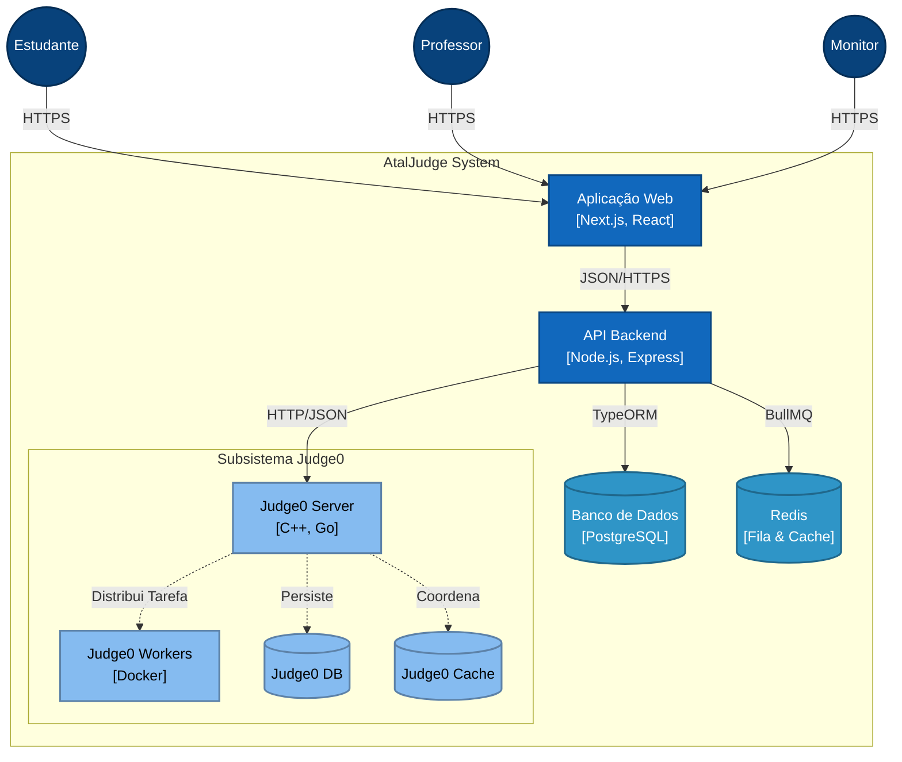

# Diagramas de Arquitetura - AtalJudge

## Diagrama de Container (C4 Model)

Este diagrama detalha os contêineres que compõem o sistema AtalJudge, suas responsabilidades e tecnologias.

## Versão Compatível com Draw.io

Para editar este diagrama no **Draw.io**:
1. Abra o [draw.io](https://app.diagrams.net/).
2. Vá em **Arrange > Insert > Advanced > Mermaid**.
3. Cole o código abaixo (esta versão usa sintaxe padrão `graph TD` que é 100% suportada, ao contrário da sintaxe C4 que pode exigir plugins).

### Decisões Arquiteturais Relevantes

1. **Separação Frontend/Backend**: O Frontend em **Next.js** atua como uma SPA (Single Page Application) focada na experiência do usuário, enquanto o Backend em **Node.js/Express** centraliza a lógica de negócios.
2. **Processamento Assíncrono**: A comunicação entre a API e o Judge0 não é direta/bloqueante para o cliente final. A API utiliza uma fila **Redis (BullMQ)** para gerenciar picos de carga, garantindo que o servidor não trave mesmo com múltiplas submissões simultâneas.
3. **Isolamento de Execução**: O subsistema **Judge0** roda isolado, com seu próprio banco de dados e Redis, garantindo que falhas na execução de código (ex: loops infinitos, estourar memória) não afetem o banco de dados principal da aplicação.
